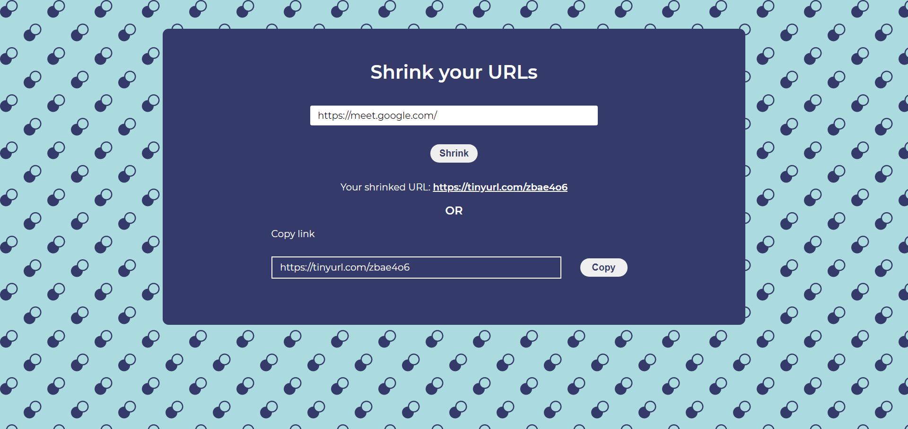

# React URL Shortener App

This project was built using react and hosted on netlify.
You can shrink any URL you want.

##

```
NPM packages used
- react
- react-hot-toast
- react-copy-to-clipboard
- tinyurl

```

- For Live demo, [click here:](https://url-shrinker.netlify.app/)

- 
- 

```
Mobile View
```

- 
- 
